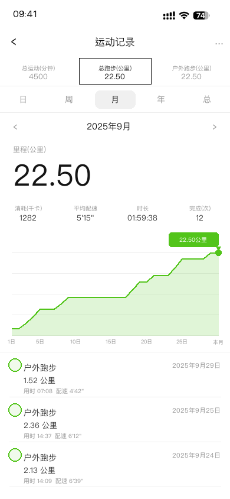

# Keep 跑步截图生成器

生成仿 Keep App「月」视图的跑步记录截图，用于学校运动健康信息填报的示例展示。

## 效果



## 环境要求

- macOS（依赖系统自带的 PingFang、San Francisco 字体）
- Python 3.9+
- Pillow：`pip install pillow`

## 快速开始

### 生成单张

```bash
python3 generate_keep.py \
  --year 2025 --month 9 \
  --distance 22.5 \   # 当月总距离 (km)
  --runs 12 \          # 当月跑步次数
  --time 17:43 \       # 截图左上角时间
  --total-minutes 4500 # Keep 历史累计运动分钟数
```

输出文件默认为 `keep_monthly_2025_09.png`，可用 `--output` 指定路径。

### 批量生成（按学期）

编辑 `batch_generate.py` 顶部的学期配置，然后运行：

```bash
python3 batch_generate.py
```

脚本会自动把距离和次数分配到各月，并保证每个学期达标，截图保存在 `output/` 目录。

## 参数说明

| 参数 | 说明 | 默认值 |
|------|------|--------|
| `--year` | 年份 | 2025 |
| `--month` | 月份 | 9 |
| `--distance` | 当月跑步总距离 (km) | 22.0 |
| `--runs` | 当月跑步次数 | 12 |
| `--time` | 状态栏显示时间，如 `09:30` | 当前时间 |
| `--total-minutes` | Keep 历史累计运动分钟数 | 自动推算 |
| `--seed` | 随机种子（固定则每次结果相同） | 随机 |
| `--output` | 输出文件路径 | 自动命名 |

## Claude Code Skill

本项目附带一个 [Claude Code](https://claude.ai/code) Skill，可以让 Claude 主动询问你的学期范围和要求，自动规划并批量生成。

**安装方法：**

```bash
git clone https://github.com/wzsyyh/keep-screenshot.git
cp -r keep-screenshot/skill ~/.claude/skills/keep-screenshot
```

安装后在 Claude Code 中提到「Keep 截图」「跑步记录截图」等关键词即可触发。

## 注意事项

- 状态栏右侧图标（信号/Wi-Fi/电池）来自真实 Keep 截图裁剪，电量固定显示 74%
- 字体依赖 macOS 系统内置，非 macOS 环境会自动降级到 STHeiti
- `output/` 目录已加入 `.gitignore`，生成的截图不会被提交
